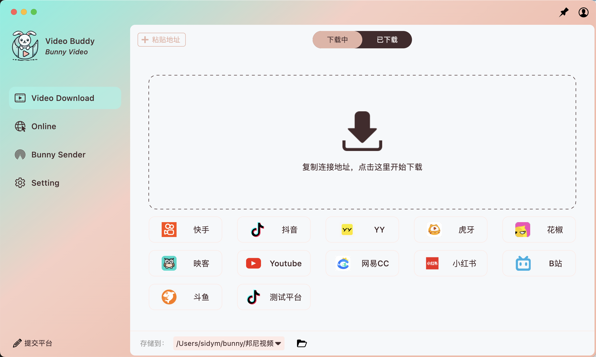
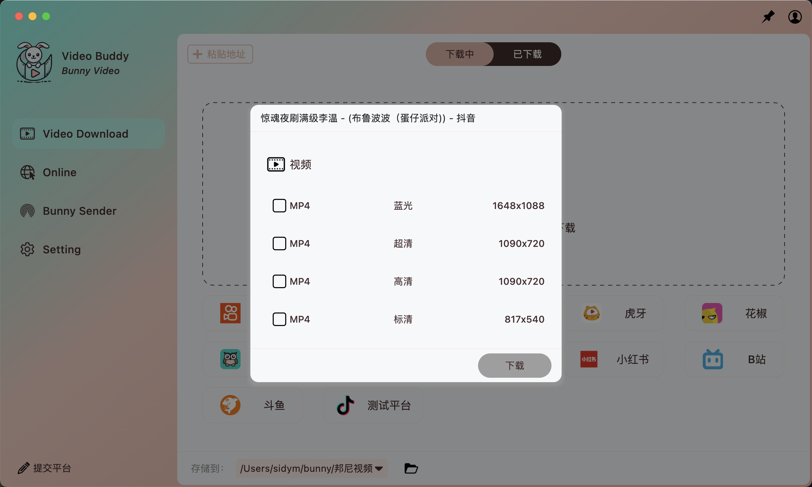
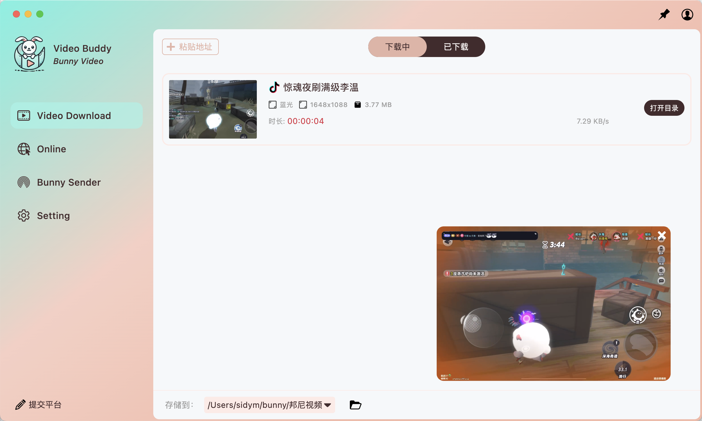
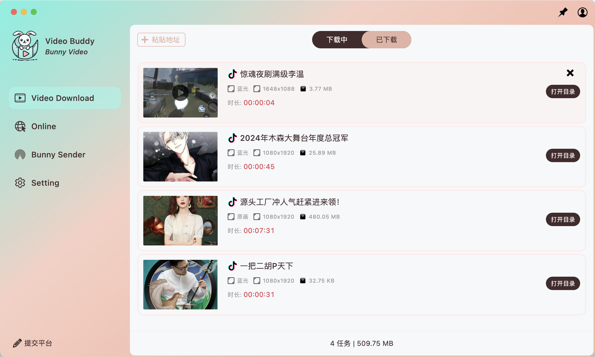
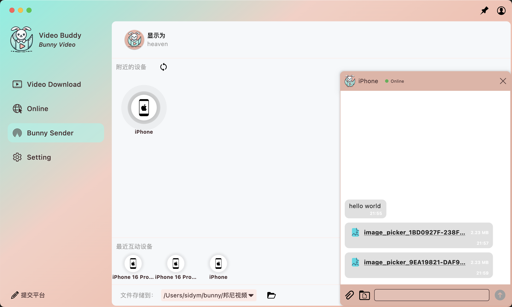

# 🐰 Bunny Video Buddy

**Bunny Video Buddy** is a versatile, lightweight application combining two powerful tools:

1. 🎥 **Live Stream Recorder**  
   Seamlessly record livestreams from popular short video platforms (like TikTok, Douyin, Youtube, etc.) and save them locally for later viewing or content archiving.

2. 📡 **Bunny Sender**  
   A lightweight, cross-platform LAN file and message transfer tool built with Flutter. It allows devices on the same local network to send files and text messages with a clean, chat-style interface — no login or setup required.

---

## 🚀 Features

### 🎥 Live Stream Recorder
- Supports recording livestreams from mainstream short video platforms.
- Automatically saves recorded content to your local device.
- Ideal for content creators, editors, or archivers.
- Designed with performance and reliability in mind.

### 📡 Bunny Sender
- 🔄 Cross-platform: Works on Android, iOS, Windows, macOS, and Linux.
- 🌐 Local Network Only: All transfers happen via LAN, ensuring speed and privacy.
- 🗂️ File Transfer: Send images, videos, documents, and any other files instantly.
- 💬 Chat-style Messaging: Text messages are displayed in an intuitive chat format.
- 🔒 No login, no cloud, no ads — 100% private.

---

## 📷 Screenshots

  

  

  
  

  
  

  

